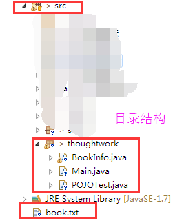
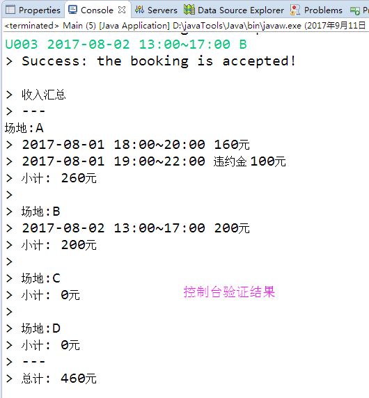
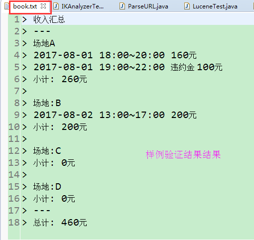

##1. 结构介绍
分三部分：
1. POJO：BookInfo对象，保存用户Id，租用时间段，场地，预约或取消操作，花费金额信息。当传入msg字符串合法，才能创建对象，否则打印avalid错误。
2. POJO测试类，main函数测试BookInfo的正确性。
3. Main类：主要运行类：
   - mian()函数：用于输入，调用处理过程，输出结果
   - addList(bookInfo)：将bookInfo添加到集合中
   - saveFileItemsToTxt()：保存打印信息

##2. 如何运行
运行Main类，在控制台输入字符串，每输入一行，会显现成功或失败信息。输入完成后，再次键入Enter键，将汇总结果打印出来并保存到文件。

##3. 流程

/**
 * 1. 输入由于当出现空行时打印信息，故输入采用BufferedReader，不能用Scanner；
 *    当连续输入时，处理输入信息； 当有空行(即" ")时，汇总信息并输出到book.txt，同时控制台打印
 *    
 * 2. 输入字符串信息作为参数传给BookInfo的构造器，BookInfo包含输入的Uid，时间date，场地spot，操作（预定B或取消C），
 *    唯一识别info(info包含Uid,date,spot,只有三者都相同(时间部分为有重叠)，才认为冲突)。
 *    信息正确则BookInfo对象可以生成，否则打印invalid信息。
 *    消费cost较为复杂，因为涉及到用户开始时间不固定，结束时间不固定，及使用时长不固定问题，而不同时间段费用不同，故而分段处理。
 *    
 * 3. 将该BookInfo对象加入list中。在加之前，要进行唯一标识info检验，时间检验为判断是否重合。当合法时，将其加入list，
 *    否则打印对应的不合法信息。
 *    
 * 4. 按场地ABCD分别输出自个的费用信息到文件，并在控制台打印。
 */

##4. 样例输出

以下为样例2输出结果：

```java
> 收入汇总
> ---
> 场地A
> 2017-08-01 18:00~20:00 160元
> 2017-08-01 19:00~22:00 违约金 100元
> 小计: 260元
> 
> 场地:B
> 2017-08-02 13:00~17:00 200元
> 小计: 200元
> 
> 场地:C
> 小计: 0元
> 
> 场地:D
> 小计: 0元
> ---
> 总计: 460元
```
截图：




##个人信息

王洪兵
13027105554
whbing1991@gmail.com
